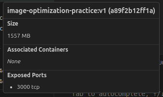
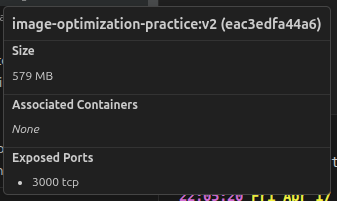
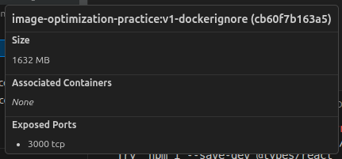
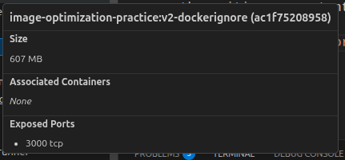
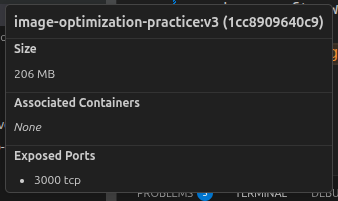
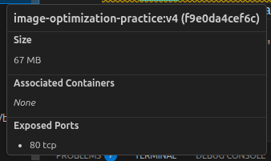
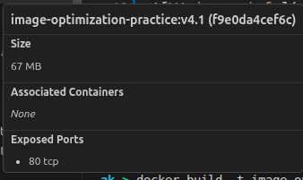

# Observations

## V1: normal base and normal build [[Dockerfile-v1]]

image info: 

> **Review Note:** In `Dockerfile-v1`, `COPY package*.json .` copies from the root context, which doesn't have the `package.json` (it's inside `vite-react-template`). Also, `COPY ./vite-react-template .` overwrites and negates the caching benefit because it copies everything before running `npm install`. This results in `npm install` running every time a source file changes!

## V2: light weight image [[Dockerfile-v2]]

image info: 

> **Review Note:** Just like V1, V2 entirely misses layer caching for dependencies. It uses `COPY ./vite-react-template .` immediately followed by `RUN npm install`. This means a single line change in your source code will trigger a full, slow re-install of all `npm` packages.

- we need to note that the light-weight image is stripped of several component for exampl I needed to install pnpm manually to run the vite server

## Adding .dockerignore [[.dockerignore]]

Adding .dockerignore to not copy all the files needed funnily enough it increased the image size I have added the .gitignore content fully in the .dockerignore.

## Using layer caching

By setting the unchanged lines first like exposing port installing needed packages makes the image build faster on future edits.

## Layer squaching [[Dockerfile-v3]]

Setting the dependent command together and deleting cache afterward can save a lot of space.

Instead of installing package then building we can do this in the same layer and deleting the installed packages afterward.

> **Review Note:** Wait! If you delete `node_modules` inside the same layer after building the app, running `npm run preview` in your `CMD` will fail. The `preview` command relies on `node_modules` (specifically the Vite CLI) to spin up the local preview server. This is exactly why **Multi-Stage Builds** (V4) are the correct solution: they let you leave the source and `node_modules` behind, purely copying the compiled static assets into an `nginx` image to serve them.

## Multi-Stage Build [[Dockerfile-v4]]

- Why use multi-stage build?
It splits the operations in different image for example we have split the image into 2 stages instead of using npm to distribute the application we just use it to build the html & scripts and after that use the nginx to serve these files.

- the only remaining files in the image is the files of the last layer the previous layers isn't maintained in the image unless referenced so even if we use the full image for the build the sized remain the same as long as the last stage image is the same.

